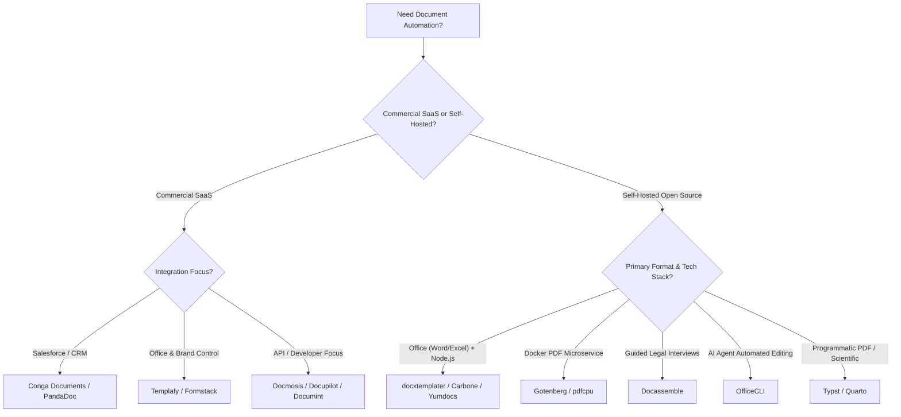

# Awesome Document Automation 🚀

      

---

## 📌 Overview & SEO Summary

Welcome to **Awesome Document Automation** — the premier curated directory of enterprise **SaaS products**, **developer APIs**, and active **open-source libraries** for document automation, template-driven PDF/DOCX generation, and automated document assembly.

Whether you are building automated contract workflows, generating data-driven financial reports, embedding PDF rendering microservices into cloud applications, or utilizing AI agents for document creation, this list covers the leading solutions across commercial and open-source ecosystems.

---

## 📑 Table of Contents

- [📊 SaaS & Commercial Platforms](#-saas--commercial-platforms)
- [🔓 Open-Source GitHub Projects](#-open-source-github-projects)
- [💡 Choosing the Right Document Automation Engine](#-choosing-the-right-document-automation-engine)
- [🤝 How to Contribute](#-how-to-contribute)
- [📈 Star History](#-star-history)
- [💖 Support & Community](#-support--community)
- [⚠️ Disclaimer](#%EF%B8%8F-disclaimer)

---

## 📊 SaaS & Commercial Platforms

> 🌐 **Market Size & Industry Structure**: The global document automation market is estimated at **$3.2 Billion (2026)** and is projected to reach **$8.5 Billion by 2032** growing at a 18.2% CAGR. The sector is **moderately fragmented**, dominated by enterprise giants like Conga, PandaDoc, and Templafy for CRM/Office automation, alongside specialized document APIs and rapidly innovating self-hosted open-source document engines.

The table below summarizes top enterprise document generation platforms, ordered by estimated company size / revenue / valuation (descending):

| 🏢 Product | 📜 Description & Capabilities | 💰 Starting Price | 🎁 Free Tier / Trial Limit | 📊 Company Size / Revenue / Valuation |
| :--- | :--- | :--- | :--- | :--- |
| **[Conga Documents](https://conga.com/)** | Enterprise document generation & contract lifecycle management (CLM) deeply integrated with Salesforce, Microsoft Dynamics, and ERP systems. | **$20.00** / user / mo | **30-Day Free Trial** (AppExchange test drive) | **~$300M ARR** ($1.3B Valuation / Thoma Bravo) |
| **[PandaDoc](https://www.pandadoc.com/)** | End-to-end document automation, CPQ, e-signature, and proposal management platform with automated workflow triggers. | **$19.00** / user / mo | **14-Day Free Trial** (Or Free Plan: 5 docs/mo) | **~$100M ARR** ($1.0B Unicorn Valuation) |
| **[Templafy](https://www.templafy.com/)** | Enterprise content governance and document assembly platform integrated with MS Office and Google Workspace for brand compliance. | **$15.00** / user / mo | **14-Day Free Trial** (Enterprise sandbox setup) | **~$75M ARR** (~$500M Valuation) |
| **[Formstack Documents](https://www.formstack.com/products/documents)** | Cloud document generation engine (formerly WebMerge) merging form data into PDF, Word, Excel, and PowerPoint templates. | **$92.00** / month | **14-Day Free Trial** (Up to 20 test documents) | **~$60M ARR** (~$500M Valuation) |
| **[HotDocs](https://www.hotdocs.com/)** | Long-standing legal, insurance, and banking document assembly platform featuring guided Q&A interviews and template building. | **$25.00** / user / mo | **30-Day Free Trial** (On-demand test workspace) | **~$50M ARR** (~$300M Parent CARET Valuation) |
| **[Windward](https://www.windwardstudios.com/)** | High-performance enterprise document generation and reporting engine for embedding into Java and .NET enterprise software. | **$249.00** / month | **14-Day Free Trial** (Watermarked engine key) | **~$15M ARR** (~50 Employees) |
| **[Plumsail Documents](https://plumsail.com/documents/)** | Flexible document generation service for Power Automate, SharePoint, REST API, and webhooks with Word/Excel template merging. | **$25.00** / month | **30-Day Free Trial** (Up to 30 document runs) | **~$8M ARR** (~30 Employees) |
| **[Docmosis](https://www.docmosis.com/)** | High-volume template-based document generation cloud service and self-hosted engine with REST & Java APIs. | **$29.00** / month | **14-Day Free Trial** (100 test document calls) | **~$5M ARR** (~20 Employees) |
| **[Docupilot](https://docupilot.app/)** | Template-driven document creation platform for automated invoices, contracts, proposals, and certificates from webhooks & forms. | **$29.00** / month | **30-Day Free Trial** (Up to 30 test generation runs) | **~$3M ARR** (~15 Employees) |
| **[Documint](https://documint.me/)** | Visual document builder and PDF generation API for micro-SaaS, Airtable, Zapier, and custom software integrations. | **$15.00** / month | **Free Forever Plan** (Up to 20 documents/month) | **~$1M ARR** (~10 Employees) |

---

## 🔓 Open-Source GitHub Projects

The open-source document automation ecosystem provides powerful template engines, headless PDF converters, and guided legal interview systems for self-hosting.

Projects below are sorted by GitHub Stars_Count (descending):

1. **[Typst](https://github.com/typst/typst)**   
   *A modern, markup-based typesetting system that is as powerful as LaTeX while being simple to learn and lightning fast to compile.* Features instant preview, clean syntax, programmable layout functions, and high-fidelity PDF rendering. Ideal for dynamic document generation, scientific publishing, and automated report compilation. **(License: Apache-2.0)**

2. **[OfficeCLI](https://github.com/iOfficeAI/OfficeCLI)**   
   *First open-source Office suite built specifically for AI agents to read, edit, and automate Word, Excel, and PowerPoint files.* Offers headless single-binary execution with no Microsoft Office dependencies. Includes built-in high-fidelity HTML rendering so AI agents can visually inspect generated layouts and fix overflows automatically. **(License: MIT)**

3. **[Gotenberg](https://github.com/gotenberg/gotenberg)**   
   *A developer-friendly Docker-powered stateless API for converting HTML, Markdown, Word, Excel, and Office documents into native PDFs.* Integrates Chromium for web page conversion and LibreOffice for document rendering. Highly scalable for microservice architectures. **(License: MIT)**

4. **[pdfcpu](https://github.com/pdfcpu/pdfcpu)**   
   *A high-performance PDF processing library and command-line utility written in Go.* Supports PDF creation, encryption, watermark injection, page extraction, merging, splitting, and form filling with minimal memory footprint. **(License: Apache-2.0)**

5. **[Quarto](https://github.com/quarto-dev/quarto-cli)**   
   *Open-source scientific and technical publishing system built on Pandoc.* Combines text, executable Python/R/Julia code, and interactive visual outputs into publication-grade PDFs, Word docs, HTML dashboards, and presentations. **(License: GPL-2.0)**

6. **[docxtemplater](https://github.com/open-xml-templating/docxtemplater)**   
   *The industry-standard JavaScript/Node.js library for generating DOCX, PPTX, and XLSX documents from Microsoft Office templates.* Allows template design using natural placeholding like `{name}` and loops `{#users}{name}{/users}` directly in Word or PowerPoint. **(License: MIT Core)**

7. **[Carbone](https://github.com/carboneio/carbone)**   
   *Fast, multi-format report generator that converts JSON data into PDF, DOCX, XLSX, ODT, and PPTX via LibreOffice integration.* Features straightforward tags, conditional dynamic tables, and web-ready document rendering pipelines. **(License: Apache-2.0)**

8. **[Docassemble](https://github.com/jhpyle/docassemble)**   
   *Full-stack expert system for guided Q&A interviews and automated document assembly.* Built on Python, YAML, and Docker, Docassemble powers legal aid tools, court intake systems, and enterprise compliance workflows with logic-based document creation. **(License: MIT)**

9. **[Docx-stamper](https://github.com/thombergs/docx-stamper)**   
   *Spring-friendly Java template engine for populating DOCX files.* Uses Spring Expression Language (SpEL) in Microsoft Word documents to conditionally replace text, insert images, and iterate table rows. **(License: MIT)**

10. **[Wraft](https://github.com/wraft/wraft)**   
    *An open-source Document Lifecycle Management platform built on open formats (Markdown and JSON).* Streamlines structured document authoring, approval workflows, and automated distribution for enterprise documentation. **(License: AGPL-3.0)**

11. **[Yumdocs](https://github.com/yumdocs/yumdocs)**   
    *Lightweight JavaScript template engine for Word, PowerPoint, and Excel files.* Merges document templates with JSON using expression tags (`{{field}}`) without external binary runtime requirements. **(License: MIT)**

12. **[Document Templater](https://github.com/m4nd0mb3/document-templater)**   
    *Node.js and Express microservice for template-driven document generation built on Carbone.* Includes ready-to-deploy Docker containers and Swagger OpenAPI docs for API integrations. **(License: Apache-2.0)**

13. **[AavanamKit](https://github.com/jafranjemal/aavanamkit)**   
    *Open-source full-stack framework with React WYSIWYG designer and Node.js headless engine.* Merges JSON data with visual templates to output pixel-perfect vector PDFs and DOCX files. **(License: MIT)**

14. **[Aldina](https://github.com/clbrge/aldina)**   
    *Open-source theme engine that transforms structured text content into print-grade brand documents and reports.* Utilizes ChoirMark format and headless Chromium page checks. **(License: AGPL-3.0)**

---

## 💡 Choosing the Right Document Automation Engine

---

## 🤝 How to Contribute

We welcome community contributions! To add a new document automation SaaS or open-source repository:

1. **Fork this repository**.
2. Edit `README.md` and insert your tool into the appropriate table or list following alphabetical/star/revenue sorting.
3. Ensure open-source projects include a valid Stars_Badge linking to their stargazers page.
4. Check out our meta awesome list: [Awesome-Awesome-Awesome](https://github.com/ishandutta2007/Awesome-Awesome-Awesome).
5. Open a **Pull Request** with a brief summary of the proposed addition.

---

## 📈 Star History

---

## 💖 Support & Community

Thank you for exploring **Awesome Document Automation**! If this repository has helped you evaluate tools or build document generation pipelines:

- ⭐ **Star this repository** to help others discover it on GitHub.
- 🔀 **Fork and share** with team members and developers.
- 💬 **Join our community** on [Discord](https://discord.gg/jc4xtF58Ve) to discuss document workflows and automation ideas.
- ☕ **Sponsor / Buy me a coffee**: Support ongoing maintenance via the [GitHub Sponsor Dashboard](https://github.com/sponsors/ishandutta2007).

---

## ⚠️ Disclaimer

- This list is **community-curated** for educational and research purposes.
- Always review data protection policies (GDPR, HIPAA, SOC 2) when handling confidential contracts or customer data in SaaS or self-hosted document engines.

---

  <b>Curated with ❤️ for Developers, Legal Technologists, and Automation Engineers</b>

